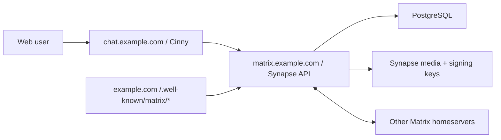

# mesugaki-chat

Cinny fork + Matrix/Synapse で、Discord風のテキストチャット基盤を作るための公開リポジトリです。

現時点では、公開してよいデプロイ雛形と改修方針を置いています。Cinny本体のfork差分は、追って `client/` に入れる予定です。

この構成の狙いは次の4つです。

- Discord風UIは Cinny をベースにして、フォーク差分を小さく保つ
- データは自前 Synapse + PostgreSQL に置き、外部BANで全損しない
- Federation は Matrix 標準で受ける
- E2EE は Matrix の暗号化ルームを標準運用にする

## 構成



## 推奨ドメイン

Matrix の `server_name` は後から変えない前提で決めます。おすすめはこれです。

- `SERVER_NAME=example.com`
- `MATRIX_HOST=matrix.example.com`
- `CHAT_HOST=chat.example.com`

この場合、ユーザーIDは `@alice:example.com` になり、実体のAPIは `https://matrix.example.com` で動きます。

## Quick Start

1. DNS を設定します。

   - `example.com` をこのサーバーへ向ける、または既存サイトで `/.well-known/matrix/*` を配信できるようにする
   - `matrix.example.com` をこのサーバーへ向ける
   - `chat.example.com` をこのサーバーへ向ける

2. `.env.example` を `.env` にコピーし、値を入れます。

   ```sh
   cp .env.example .env
   ```

3. Synapse の初期設定ファイルを生成します。

   ```sh
   docker compose --profile generate run --rm synapse-generate
   ```

4. `synapse/data/homeserver.yaml` を編集します。

   最低限、以下を確認してください。

   ```yaml
   public_baseurl: "https://matrix.example.com/"

   database:
     name: psycopg2
     args:
       user: synapse
       password: "replace-with-the-same-value-as-POSTGRES_PASSWORD"
       dbname: synapse
       host: postgres
       cp_min: 5
       cp_max: 10

   enable_registration: false
   allow_guest_access: false
   ```

5. `cinny/config.json` の `homeserverList` を自分の `SERVER_NAME` に合わせます。

   ```json
   {
     "defaultHomeserver": 0,
     "homeserverList": ["example.com"],
     "allowCustomHomeservers": false
   }
   ```

6. 起動します。

   ```sh
   docker compose up -d
   ```

7. 管理ユーザーを作ります。

   一時的に `homeserver.yaml` に `registration_shared_secret` を設定して Synapse を再起動し、以下を実行します。

   ```sh
   docker compose exec synapse register_new_matrix_user -c /data/homeserver.yaml http://localhost:8008
   ```

   作成が終わったら、不要であれば `registration_shared_secret` を削除して再起動します。

## 自宅サーバで動かす場合

LAN内のサーバーが `192.168.11.30` の場合、ルーターで最低限以下を転送します。

- WAN `80/tcp` -> `192.168.11.30:80`
- WAN `443/tcp` -> `192.168.11.30:443`

このスターターのCaddy構成は `.well-known/matrix/server` で `matrix.example.com:443` に委譲するため、通常は `8448/tcp` を開けずに Federation できます。

詳しくは [docs/home-server-network.md](docs/home-server-network.md) を見てください。

## 最初のMVP

初回リリースはフォークを深く触りすぎず、次の状態をゴールにします。

- Synapse + PostgreSQL + HTTPS + well-known が動く
- Cinny を自分の homeserver 固定で公開する
- 新規登録は閉じ、管理者がユーザーを作る
- 暗号化ルームを標準にする運用ルールを置く
- DB、media、signing key のバックアップと復元テストをする

## 改修参加

改修案は Issue へ、実装案は Pull Request へお願いします。

- UI/文言/テーマ改修: `client/` に入るCinny forkが対象
- デプロイ/運用改修: `compose.yaml`, `docs/`, `scripts/` が対象
- セキュリティ報告: [SECURITY.md](SECURITY.md) を見てください

## 重要な注意

- Matrix の `server_name` は実質的に恒久IDです。最初に決めてから運用してください。
- E2EE はメッセージ本文を守りますが、サーバーにはメタデータ、ルーム状態、メディア、暗号化済みイベントが残ります。
- Federation したルームのデータは参加homeserverにも複製されます。E2EEルームでも、参加関係やイベントメタデータの扱いは理解しておく必要があります。
- Cinny は AGPL-3.0 です。公開運用するフォークは、利用者が対応するソースを見られる導線を用意する前提で進めるのが安全です。
- `.env`, Synapse signing key, DBパスワード、Cloudflare証明書、実サーバの運用メモはコミットしないでください。

## 参考リンク

- Cinny: https://github.com/cinnyapp/cinny
- Cinny container package: https://github.com/orgs/cinnyapp/packages/container/package/cinny
- Synapse install docs: https://element-hq.github.io/synapse/latest/setup/installation.html
- Synapse Docker README: https://github.com/element-hq/synapse/blob/develop/docker/README.md
- Matrix Client-Server API / E2EE: https://spec.matrix.org/latest/client-server-api/#end-to-end-encryption
- Matrix Server-Server API / Federation: https://spec.matrix.org/latest/server-server-api/
