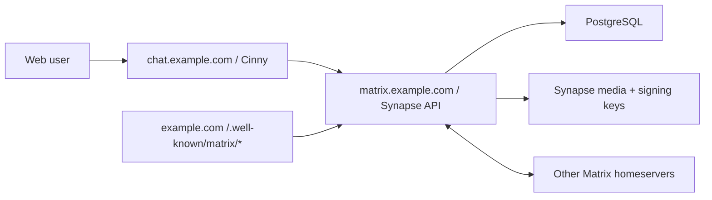

# SelfMatrix

Cinny fork + Matrix/Synapse で、Discord 風のテキストチャット + 通話基盤を作るための公開リポジトリです。

現時点では、公開してよいデプロイ雛形と計画ドキュメントを置いています。要件・目標構成・進行計画は `docs/requirements.md` / `docs/architecture.md` / `docs/roadmap.md` を正とします。クライアント fork の差分は、選定スパイク(`docs/client-spike.md`)の完了後に `client/` へ入れる予定です。

この構成の狙いは次の5つです。

- Discord 風 UI はクライアント fork(第一候補 Cinny)をベースにして、フォーク差分を小さく保つ
- データは自前 Synapse + PostgreSQL に置き、外部 BAN でもログ(履歴・メディア・在籍記録)を失わない
- Federation は Matrix 標準で受ける
- E2EE は Matrix の暗号化ルームを標準運用にする
- 通話・配信は MatrixRTC(Element Call + LiveKit)標準に寄せ、ハイレゾ音声のみ別系統で扱う

## 構成

現在の compose が提供するのはテキスト基盤(roadmap Phase 1 相当)です。



通話(LiveKit SFU / lk-jwt-service)とハイレゾ音声を含む目標構成、および2つのデプロイ形態(自宅 + VPS / VPS 単独)は [docs/architecture.md](docs/architecture.md) を見てください。

## 推奨ドメイン

Matrix の `server_name` は後から変えない前提で決めます。おすすめはこれです。

- `SERVER_NAME=example.com`
- `MATRIX_HOST=matrix.example.com`
- `CHAT_HOST=chat.example.com`

この場合、ユーザーIDは `@alice:example.com` になり、実体のAPIは `https://matrix.example.com` で動きます。通話導入時(roadmap Phase 3)には、Cloudflare を通さない RTC 用ホスト(例: `rtc.example.com`)を追加する予定です。

## Quick Start

1. DNS を設定します。

  - `example.com` をこのサーバーへ向ける、または既存サイトで `/.well-known/matrix/*` を配信できるようにする
  - `matrix.example.com` をこのサーバーへ向ける
  - `chat.example.com` をこのサーバーへ向ける

2. `.env.example` を `.env` にコピーし、値を入れます。

```
cp .env.example .env
```

3. Synapse の設定を生成します。`.env` の値から `homeserver.yaml` を生成し、PostgreSQL 接続・`public_baseurl`・アップロード上限・登録無効化・MatrixRTC の feature flag まで自動で入れます(**手で編集する必要はありません**)。

```
bash scripts/generate-synapse-config.sh
```

    (作り直したいときは `--force` を付けます。既存の `homeserver.yaml` を上書きします。)

4. `cinny/config.json` を自分の `SERVER_NAME` で生成します(手で `homeserverList` を編集しても同じです)。

```
bash scripts/generate-cinny-config.sh
```

    生成される内容(homeserver 固定・カスタムサーバー無効・探索タブ非表示):

```
{
  "defaultHomeserver": 0,
  "homeserverList": ["example.com"],
  "allowCustomHomeservers": false,
  "hideExplore": true
}
```

    クライアントのイメージは SelfMatrix fork(`ghcr.io/zoobookfool/selfmatrix-cinny`)が既定です。
    別ビルドを使う場合は `.env` の `CINNY_IMAGE` / `CINNY_TAG` を差し替えます。

5. 起動します。

```
docker compose up -d
```

6. 管理ユーザーを作ります。

    一時的に `homeserver.yaml` に `registration_shared_secret` を設定して Synapse を再起動し、以下を実行します。

```
docker compose exec synapse register_new_matrix_user -c /data/homeserver.yaml http://localhost:8008
```

    作成が終わったら、不要であれば `registration_shared_secret` を削除して再起動します。

## モデレーション/招待コード登録/絵文字

- **モデレーションダッシュボード(synapse-admin)**: Web GUI でユーザー無効化・ルーム削除などを操作できます。既定では起動しません。`docker compose --profile admin up -d synapse-admin` で起動し、インターネットには公開しない前提で運用してください。詳しくは [docs/operations.md](docs/operations.md) の「モデレーションダッシュボード」節を見てください。
- **カスタム絵文字・スタンプ**: クライアント (Cinny fork) が MSC2545 image packs を実装済みです。サーバー共通絵文字の運用の型と操作手順は [docs/emoji-stickers.md](docs/emoji-stickers.md) を見てください。
- **招待コード制の自己登録**: SSO/OIDC の代替として、トークンを持つ相手だけが自己登録できるモードを用意しています。`.env` の `ENABLE_INVITE_REGISTRATION=true` と `scripts/invite-token.sh` で有効化・トークン発行します。手順は [docs/operations.md](docs/operations.md) の「招待トークンでの登録」節を見てください。
- **カスタムホームサーバーでのログイン**: `.env` の `ALLOW_CUSTOM_HOMESERVERS=true` にすると、ログイン画面に「カスタムホームサーバー」の選択肢が増え、このサーバーにアカウントを作らずに、他の Matrix ホームサーバー (matrix.org 等) の既存アカウントでこのクライアントにログインできます。既定のホームサーバーの選択はそのまま残るので通常の登録導線には影響しません。**通話の SFU は先にルームへ参加した人のホームサーバーの設定が使われる (早い者勝ち)** ため、自サーバーの回線で検証したいときは自サーバーのアカウントを先に通話へ参加させてください。

## バックアップと復元

`scripts/backup.sh` が PostgreSQL のダンプ・**署名鍵**(これを失うとサーバーの federation 上の身元が恒久的に失われます)・設定・メディアを 1 世代のディレクトリにまとめ、チェックサムを付けて `backups/` に保存します(既定で最新 7 世代を保持)。署名鍵とメディアの読み取りに `sudo` を使います。

```
bash scripts/backup.sh
```

自動化するには systemd タイマーを入れます(毎日 04:00)。

```
# scripts/systemd/selfmatrix-backup.service の User と WorkingDirectory を自分の環境に合わせてから:
sudo cp scripts/systemd/selfmatrix-backup.* /etc/systemd/system/
sudo systemctl daemon-reload
sudo systemctl enable --now selfmatrix-backup.timer
```

**復元できることを定期的に確かめてください。** `--drill` は使い捨ての一時 DB に復元して行数を報告し、本番には一切触れません。

```
bash scripts/restore.sh backups/<timestamp> --drill
```

実際に本番へ戻すとき(DB 消失など)は `--drill` を外します。破壊的操作なので確認プロンプトが出ます。

```
bash scripts/restore.sh backups/<timestamp>
```

## ネットワーク経路

目標の経路は「外部 → Cloudflare → VPS → Tailscale → 自宅サーバー(HTTP系のみ)」+「メディアは Cloudflare を迂回して VPS 直終端」です。この経路では自宅ルーターのポート開放が不要になります。従来の自宅直公開(80/443 転送)も代替案として残しています。詳細と両者の比較は [docs/home-server-network.md](docs/home-server-network.md) を見てください。

## デプロイ形態

このスターターは 3 つのデプロイ形態をサポートします。roadmap では「compose profile で切り替えられる構成」を目標にしていますが、現時点では override ファイルを重ねる方式で実現しています(正直な現状です)。

- **①自宅直公開**: `docker compose up -d` をそのまま実行します(caddy が 80/443 で TLS 終端)。自宅回線に固定 IP かつポート開放ができ、VPS を用意したくない人向けです。
- **②VPS 単独**: ①と同じく既定の compose をそのまま `up` します。`rtc/` もこの同じ VPS に載せます。自宅回線の制約(CGNAT など)を避けたいが、VPS 1 台に集約したい人向けです。
- **③自宅+VPS(経路A、推奨)**: `docker-compose.route-a.example.yml` を override として重ね、edge を VPS にします。自宅の WAN IP を晒したくない、かつデータは自宅に置きたい人向けです。

```
cp docker-compose.route-a.example.yml docker-compose.override.yml
```

`.env` に `BACKEND_BIND_IP=<Tailscale 等のプライベート IP>` を追記してください。edge 側(VPS)の nginx 設定例は [MatrixRTC backend の「リバースプロキシ例(nginx)」節](#リバースプロキシ例nginx)を参考にしてください(RTC 用の例ですが、location とヘッダの組み立て方はそのまま流用できます)。

**②VPS 単独形態の注意**: データが VPS 1 台に載るため、外部(VPS 外)への定期バックアップが必須です。手順は [docs/operations.md](docs/operations.md) の「外部バックアップ(VPS 単独形態)」節を見てください。

## MatrixRTC backend (Phase 3)

通話(LiveKit SFU + lk-jwt-service)は `rtc/` に独立した compose ファイルを用意しています。メインの `compose.yaml` とは別に、VPS で単独運用できる形にしています。

1. `rtc/.env.example` を `rtc/.env` にコピーし、値を入れます(メインの `.env` とは別ファイルです)。

```
cp rtc/.env.example rtc/.env
```

2. `rtc/livekit.yaml` を生成します。`livekit.yaml` は LiveKit 自身が環境変数を展開できない(`node_ip` など)ため、`rtc/.env` の値からテンプレートを埋め込んで生成する方式です。プレースホルダのままだと生成スクリプトが止まります。

```
bash rtc/generate-livekit-config.sh
```

3. 起動します。

```
docker compose -f rtc/compose.yaml up -d
```

    `livekit` サービスは `network_mode: host` で動きます(ICE 経路を単純化するため、コンテナ個別のポートマッピングをせずホストの UDP レンジをそのまま使います)。`lk-jwt` サービスは `127.0.0.1:6080` にのみ公開し、外部へは既存のリバースプロキシ経由で通します(このリポジトリの compose 自体はリバースプロキシを持ちません)。

### ファイアウォール要件

- `7881/tcp`(LiveKit RTC over TCP、フォールバック用)
- `50100-50200/udp`(LiveKit の WebRTC メディアポートレンジ)
- `443/tcp`, `80/tcp`(リバースプロキシ経由の signaling / JWT 発行)

### DNS 要件

`RTC_HOST`(例: `rtc.example.com`)は Cloudflare などの CDN プロキシを経由しない DNS only のレコードにしてください。WebRTC の UDP メディアは CDN プロキシを通過できないため、クライアントがこのホストの IP に直接到達できる必要があります。

### リバースプロキシ例(nginx)

このリポジトリの compose は 443/80 を LiveKit 用には開けていません。前段に既存の edge リバースプロキシがある想定で、`RTC_HOST` 宛のトラフィックを次のように振り分けてください。

```nginx
server {
    listen 443 ssl;
    server_name rtc.example.com;

    # ... ssl_certificate / ssl_certificate_key ...

    location ^~ /livekit/jwt/ {
        proxy_set_header Host $host;
        proxy_set_header X-Forwarded-For $proxy_add_x_forwarded_for;
        proxy_set_header X-Forwarded-Proto $scheme;
        proxy_pass http://127.0.0.1:6080/;
    }

    location ^~ /livekit/sfu/ {
        proxy_set_header Host $host;
        proxy_set_header X-Forwarded-For $proxy_add_x_forwarded_for;
        proxy_set_header X-Forwarded-Proto $scheme;

        proxy_http_version 1.1;
        proxy_set_header Upgrade $http_upgrade;
        proxy_set_header Connection "upgrade";
        proxy_buffering off;
        proxy_read_timeout 120;
        proxy_send_timeout 120;

        proxy_pass http://127.0.0.1:7880/;
    }
}
```

### well-known 追記例

`MATRIX_HOST` の `/.well-known/matrix/client` に `org.matrix.msc4143.rtc_foci` を追加し、クライアントがこの LiveKit backend を発見できるようにします。

```json
{
  "m.homeserver": { "base_url": "https://matrix.example.com" },
  "org.matrix.msc4143.rtc_foci": [
    { "type": "livekit", "livekit_service_url": "https://rtc.example.com/livekit/jwt" }
  ]
}
```

### Synapse 追記例

`homeserver.yaml` に MatrixRTC まわりの experimental feature を有効にします。

```yaml
experimental_features:
  msc3266_enabled: true
  msc4222_enabled: true
  msc4354_enabled: true

max_event_delay_duration: 24h
```

## ハイレゾ音声(拡張オプション)

192kHz/24bit の非圧縮音声を JackTrip (hub mode) で中継する、本体とは結合しない独立のオプションモジュールです。**別リポジトリ [zoobookfool/selfmatrix-hires](https://github.com/zoobookfool/selfmatrix-hires) として提供します**(サーバー構築スクリプト + 参加者/運用者ガイド)。クライアント fork には手を入れず、ネイティブアプリでの参加が前提です。有効化しなくても通常の通話・チャットには影響ありません。設計の経緯は [docs/hires-spike.md](docs/hires-spike.md) を参照してください。

## 計画

- 要件(MUST/SHOULD/LATER/OUT): [docs/requirements.md](docs/requirements.md)
- 目標構成と容量試算: [docs/architecture.md](docs/architecture.md)
- 進行計画(Phase 0〜7): [docs/roadmap.md](docs/roadmap.md)
- クライアント選定スパイク: [docs/client-spike.md](docs/client-spike.md) / 結果: [docs/client-spike-results.md](docs/client-spike-results.md)(Phase 2a 合格、Cinny fork 続行)
- クライアント UI 設計メモ: [docs/ui-design-notes.md](docs/ui-design-notes.md)
- ポップアウト技術検証(Phase 2b): [docs/popout-spike.md](docs/popout-spike.md)
- ホスティング各社の帯域・転送量比較: [docs/bandwidth-comparison.md](docs/bandwidth-comparison.md)
- 多言語対応 (言語パック): [docs/i18n.md](docs/i18n.md)
- 運用 runbook: [docs/operations.md](docs/operations.md)

初期リリースの目標は Phase 3(通話MVP)までです。

## 改修参加

改修案は Issue へ、実装案は Pull Request へお願いします。要件の判断基準は `docs/requirements.md` を正とします。

- UI/文言/テーマ改修: `client/` に入るクライアント fork が対象
- デプロイ/運用改修: `compose.yaml`, `docs/`, `scripts/` が対象
- セキュリティ報告: [SECURITY.md](SECURITY.md) を見てください

## 重要な注意

- Matrix の `server_name` は実質的に恒久IDです。最初に決めてから運用してください。
- E2EE はメッセージ本文を守りますが、サーバーにはメタデータ、ルーム状態、メディア、暗号化済みイベントが残ります。
- Federation したルームのデータは参加 homeserver にも複製されます。E2EE ルームでも、参加関係やイベントメタデータの扱いは理解しておく必要があります。
- Cinny は AGPL-3.0 です。公開運用するフォークは、利用者が対応するソースを見られる導線を用意する前提で進めるのが安全です。
- `.env`, Synapse signing key, DBパスワード、Cloudflare証明書、実サーバの運用メモはコミットしないでください。

## 参考リンク

- Cinny: <https://github.com/cinnyapp/cinny>
- SelfMatrix Cinny fork: <https://github.com/zoobookfool/selfmatrix-cinny>
- SelfMatrix container package: <https://github.com/zoobookfool/selfmatrix-cinny/pkgs/container/selfmatrix-cinny>
- Cinny container package (upstream): <https://github.com/orgs/cinnyapp/packages/container/package/cinny>
- Synapse install docs: <https://element-hq.github.io/synapse/latest/setup/installation.html>
- Synapse Docker README: <https://github.com/element-hq/synapse/blob/develop/docker/README.md>
- Matrix Client-Server API / E2EE: <https://spec.matrix.org/latest/client-server-api/#end-to-end-encryption>
- Matrix Server-Server API / Federation: <https://spec.matrix.org/latest/server-server-api/>
- Element Call self-hosting: <https://github.com/element-hq/element-call/blob/livekit/docs/self_hosting.md>
- lk-jwt-service: <https://github.com/element-hq/lk-jwt-service>
- LiveKit: <https://github.com/livekit/livekit>
