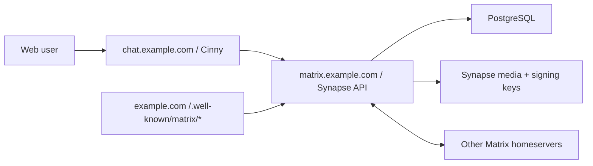

# mesugaki-chat

Cinny fork + Matrix/Synapse で、Discord 風のテキストチャット + 通話基盤を作るための公開リポジトリです。

現時点では、公開してよいデプロイ雛形と計画ドキュメントを置いています。要件・目標構成・進行計画は `docs/requirements.md` / `docs/architecture.md` / `docs/roadmap.md` を正とします。クライアント fork の差分は、選定スパイク(`docs/client-spike.md`)の完了後に `client/` へ入れる予定です。

この構成の狙いは次の5つです。

- Discord 風 UI はクライアント fork(第一候補 Cinny)をベースにして、フォーク差分を小さく保つ
- データは自前 Synapse + PostgreSQL に置き、外部 BAN でもログ(履歴・メディア・在籍記録)を失わない
- Federation は Matrix 標準で受ける
- E2EE は Matrix の暗号化ルームを標準運用にする
- 通話・配信は MatrixRTC(Element Call + LiveKit)標準に寄せ、ハイレゾ音声のみ別系統で扱う

## 構成

現在の compose が提供するのはテキスト基盤(roadmap Phase 1 相当)です。



通話(LiveKit SFU / lk-jwt-service)とハイレゾ音声を含む目標構成、および2つのデプロイ形態(自宅 + VPS / VPS 単独)は [docs/architecture.md](docs/architecture.md) を見てください。

## 推奨ドメイン

Matrix の `server_name` は後から変えない前提で決めます。おすすめはこれです。

- `SERVER_NAME=example.com`
- `MATRIX_HOST=matrix.example.com`
- `CHAT_HOST=chat.example.com`

この場合、ユーザーIDは `@alice:example.com` になり、実体のAPIは `https://matrix.example.com` で動きます。通話導入時(roadmap Phase 3)には、Cloudflare を通さない RTC 用ホスト(例: `rtc.example.com`)を追加する予定です。

## Quick Start

1. DNS を設定します。

  - `example.com` をこのサーバーへ向ける、または既存サイトで `/.well-known/matrix/*` を配信できるようにする
  - `matrix.example.com` をこのサーバーへ向ける
  - `chat.example.com` をこのサーバーへ向ける

2. `.env.example` を `.env` にコピーし、値を入れます。

```
cp .env.example .env
```

3. Synapse の初期設定ファイルを生成します。

```
docker compose --profile generate run --rm synapse-generate
```

4. `synapse/data/homeserver.yaml` を編集します。

    最低限、以下を確認してください。

```
public_baseurl: "https://matrix.example.com/"

database:
  name: psycopg2
  args:
    user: synapse
    password: "replace-with-the-same-value-as-POSTGRES_PASSWORD"
    dbname: synapse
    host: postgres
    cp_min: 5
    cp_max: 10

enable_registration: false
allow_guest_access: false
```

5. `cinny/config.json` の `homeserverList` を自分の `SERVER_NAME` に合わせます。

```
{
  "defaultHomeserver": 0,
  "homeserverList": ["example.com"],
  "allowCustomHomeservers": false
}
```

6. 起動します。

```
docker compose up -d
```

7. 管理ユーザーを作ります。

    一時的に `homeserver.yaml` に `registration_shared_secret` を設定して Synapse を再起動し、以下を実行します。

```
docker compose exec synapse register_new_matrix_user -c /data/homeserver.yaml http://localhost:8008
```

    作成が終わったら、不要であれば `registration_shared_secret` を削除して再起動します。

## ネットワーク経路

目標の経路は「外部 → Cloudflare → VPS → Tailscale → 自宅サーバー(HTTP系のみ)」+「メディアは Cloudflare を迂回して VPS 直終端」です。この経路では自宅ルーターのポート開放が不要になります。従来の自宅直公開(80/443 転送)も代替案として残しています。詳細と両者の比較は [docs/home-server-network.md](docs/home-server-network.md) を見てください。

## 計画

- 要件(MUST/SHOULD/LATER/OUT): [docs/requirements.md](docs/requirements.md)
- 目標構成と容量試算: [docs/architecture.md](docs/architecture.md)
- 進行計画(Phase 0〜7): [docs/roadmap.md](docs/roadmap.md)
- クライアント選定スパイク: [docs/client-spike.md](docs/client-spike.md) / 結果: [docs/client-spike-results.md](docs/client-spike-results.md)(Phase 2a 合格、Cinny fork 続行)
- クライアント UI 設計メモ: [docs/ui-design-notes.md](docs/ui-design-notes.md)
- ポップアウト技術検証(Phase 2b): [docs/popout-spike.md](docs/popout-spike.md)

初期リリースの目標は Phase 3(通話MVP)までです。

## 改修参加

改修案は Issue へ、実装案は Pull Request へお願いします。要件の判断基準は `docs/requirements.md` を正とします。

- UI/文言/テーマ改修: `client/` に入るクライアント fork が対象
- デプロイ/運用改修: `compose.yaml`, `docs/`, `scripts/` が対象
- セキュリティ報告: [SECURITY.md](SECURITY.md) を見てください

## 重要な注意

- Matrix の `server_name` は実質的に恒久IDです。最初に決めてから運用してください。
- E2EE はメッセージ本文を守りますが、サーバーにはメタデータ、ルーム状態、メディア、暗号化済みイベントが残ります。
- Federation したルームのデータは参加 homeserver にも複製されます。E2EE ルームでも、参加関係やイベントメタデータの扱いは理解しておく必要があります。
- Cinny は AGPL-3.0 です。公開運用するフォークは、利用者が対応するソースを見られる導線を用意する前提で進めるのが安全です。
- `.env`, Synapse signing key, DBパスワード、Cloudflare証明書、実サーバの運用メモはコミットしないでください。

## 参考リンク

- Cinny: <https://github.com/cinnyapp/cinny>
- Cinny container package: <https://github.com/orgs/cinnyapp/packages/container/package/cinny>
- Synapse install docs: <https://element-hq.github.io/synapse/latest/setup/installation.html>
- Synapse Docker README: <https://github.com/element-hq/synapse/blob/develop/docker/README.md>
- Matrix Client-Server API / E2EE: <https://spec.matrix.org/latest/client-server-api/#end-to-end-encryption>
- Matrix Server-Server API / Federation: <https://spec.matrix.org/latest/server-server-api/>
- Element Call self-hosting: <https://github.com/element-hq/element-call/blob/livekit/docs/self_hosting.md>
- lk-jwt-service: <https://github.com/element-hq/lk-jwt-service>
- LiveKit: <https://github.com/livekit/livekit>
