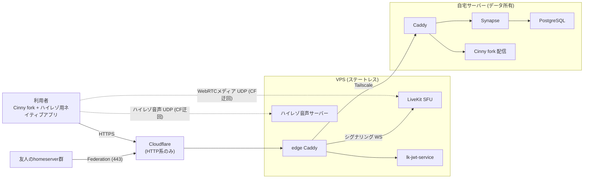

# Architecture

## Product boundaries

このプロジェクトは「Matrix クライアントを丸ごと新規実装する」のではなく、既存クライアントの UI/導線をフォークで調整し、通信・連合・E2EE・通話の媒体転送は Matrix / MatrixRTC の標準実装へ寄せます。

独自実装するのは主に以下です。

- ブランド、テーマ、アイコン、文言
- homeserver 固定化と Discord 風のサーバー/チャンネル見え方の調整
- Element Call 層のメディアパラメータ改修(4K 画面共有、Opus 384kbps)
- ハイレゾ音声系統(専用ネイティブアプリ + 中継サーバー。ただし既製ツール採用を先に検討する)
- 初回オンボーディング、鍵バックアップと端末検証の案内
- 管理者向けの運用手順

独自実装しないものは以下です。

- Federation protocol
- E2EE cryptography
- message sync protocol
- account/device/session primitives
- SFU とメディア転送プロトコル(LiveKit / MatrixRTC 標準を使う)

## System topology

要点は3つです。

- Cloudflare の proxy は HTTP(S)/WebSocket のみを通すため、UDP メディアは Cloudflare を迂回して VPS の IP に直接届く経路(DNS-only のサブドメイン)を使います。
- Tailscale 区間(VPS→自宅)には HTTP 系だけを通します。メディアをトンネルに通さないことで、MTU 断片化と DERP フォールバック時の品質劣化をメディアから切り離します。
- VPS はステートレスです。LiveKit、lk-jwt-service、ハイレゾ音声サーバーはいずれも永続データを持たず、消えたらスクリプトで再構築します。

## Component placement

| コンポーネント | 配置 | 理由 |
| --- | --- | --- |
| Synapse / PostgreSQL / media | 自宅 | データ所有が本プロジェクトの目的。外部 BAN・解約で全損しない |
| Cinny fork(静的配信) | 自宅 | HTTP 系なので既存経路で足りる |
| LiveKit SFU / lk-jwt-service | VPS | メディアの公開終端は VPS にしかなれない。自宅 IP を晒さない |
| ハイレゾ音声サーバー | VPS | 同上(UDP 終端) |
| Caddy | 両方 | VPS 側は edge/振り分け、自宅側は従来どおり |

## Deployment topologies

スターターは次の 2 形態を一級サポートします(友人の自前運用を含む)。

- **A: 自宅 + VPS**(このドキュメントの既定): データは自宅、edge Caddy と MatrixRTC backend は VPS。System topology 図と Component placement はこの形態の記述です
- **B: VPS 単独**: 全コンポーネントを 1 台の VPS に集約します。Cloudflare / Tailscale は任意。データが VPS に載るため、ログ保全(requirements.md §1)の条件として VPS 外への定期バックアップが必須です

compose の profile で両形態を切り替えられる構成を目指します(roadmap Phase 4)。

## Capacity planning(概算)

前提: 同時 10 人、通話は音声 + 画面共有(カメラなし)、4K 60fps 画面共有 ≒ 25Mbps(コーデックと内容により 20〜40)、同時共有 3 本。

- WebRTC 系: 視聴者 1 人あたり受信 ≒ 3 × 25 ≒ 75Mbps(共有中の人は 2 本受信 ≒ 50Mbps)。VPS 送出合計 ≒ 7 人 × 75 + 3 人 × 50 ≒ **0.7Gbps(ピーク)**
- ハイレゾ系(全員発話の最悪値): 非圧縮 192kHz/24bit/2ch ≒ 9.2Mbps/人 → VPS 送出 ≒ **0.8Gbps**。FLAC 等の可逆圧縮でおおむね半分以下。両系統の同時最悪値を抑えるため**ハイレゾは可逆圧縮を既定**とする
- VPS の回線帯域は当面の選定条件にしない(回線は将来変更予定)。上記は参考値として残す
- 視聴側にも 3 本同時受信 ≒ 75Mbps と 4K60 × 3 のデコード負荷がかかるため、simulcast による動的降格(requirements.md §3)は前提のまま維持する
- SFU はトランスコードしないため CPU 負荷は軽い。律速は NIC/帯域
- 将来、帯域コストが問題になった場合の代替案として「RTC 用ホストのみ自宅 IP 直公開」を保持する(秘匿性とのトレードオフ)

## Domain model

Discord の「サーバー」は Matrix では基本的に Space で表現します。

- Discord server: Matrix Space
- Discord channel: Matrix Room
- Discord voice channel: MatrixRTC の通話ルーム(Cinny の Voice/Video Room)
- private channel: invite-only encrypted Matrix Room
- DM: direct Matrix Room
- role/permission: Matrix power levels と Space/Room membership

## Realtime media model

- グループ通話は MatrixRTC(MSC4143)+ LiveKit backend(MSC4195)を使います。クライアントは `.well-known/matrix/client` の `org.matrix.msc4143.rtc_foci` から backend を発見し、lk-jwt-service で入場トークンを得て LiveKit に接続します。
- 通話は音声 + 画面共有を基本とし、カメラ映像は扱いません(requirements.md §3)。
- SFU は各運用者が自前で持ちます。MatrixRTC の focus 選択により、通話は「開始した参加者の SFU」でホストされ、他サーバーのユーザーは federated(restricted)として参加します。自前サーバーを持たない参加者は通話の開始はできず、参加のみ可能です(requirements.md §5)。
- 通話は E2EE を標準にします。メディアが借り物の VPS を通過するため、VPS 侵害時にも内容が漏れない状態を保ちます。
- 視聴品質は simulcast による動的制御を基本とし、「注視タイル高画質・他は降格」をクライアント既定にします。

## Hi-res audio subsystem

要件の正本は独立リポジトリ [zoobookfool/selfmatrix-hires](https://github.com/zoobookfool/selfmatrix-hires) の [docs/requirements.md](https://github.com/zoobookfool/selfmatrix-hires/blob/main/docs/requirements.md)(2026-07-06 ゼロベース再定義)に移管されました。本系統は本体の E2EE 方針(Realtime media model 参照)の適用対象外で、既定は平文 UDP 伝送です。以下は移管前時点の記述です。

- 目的は通話音声そのものの高音質化(192kHz/24bit)。会話が成立する片道遅延 150ms 以内を最優先します。
- 送信はネイティブアプリ + オーディオインターフェース経由。ブラウザの WebRTC/getUserMedia は 48kHz に律速されるため通しません。
- ブラウザのエコーキャンセルを通らないため、参加者はヘッドセット必須の運用とします(AEC 自前実装は将来)。
- Opus 系統との併用: 同一通話内でハイレゾ対応者同士はハイレゾ経路、非対応者へは Opus へフォールバックします。二重再生を防ぐミュート制御をクライアント側に持たせます。
- 実装は未確定です。SonoBus / JackTrip(hub モード)等の既製を 192kHz でスパイク検証し、要件を満たせば採用、満たさなければ FLAC/PCM over UDP の自作に進みます(roadmap Phase 6)。
- 映像とのリップシンクは保証しません(音声主体の設計)。

## Operational model

MVP では public registration を閉じ、管理者がユーザーを作成します。友人は本スターターで自前サーバーを建てるか、任意の homeserver でアカウントを作り、federation で接続します。

Federation は初期状態では有効化しつつ、招待制コミュニティとして小さく始めます。荒らし・スパム・不正サーバー対策が必要になった段階で、server ACL、room policy、moderation bot、allow/block 方針を整えます。

## Data ownership

自宅 Synapse に以下を保持します。

- accounts and devices
- room state and events
- encrypted event payloads
- media repository
- server signing key
- local moderation/admin state

VPS には永続データを置きません。E2EE ルームでは本文は暗号化されますが、サーバー運用者が完全に何も見えないわけではありません。バックアップ、ログ、メタデータ、Federation 先の保持範囲はプロダクト説明でも曖昧にしない方がよいです。
